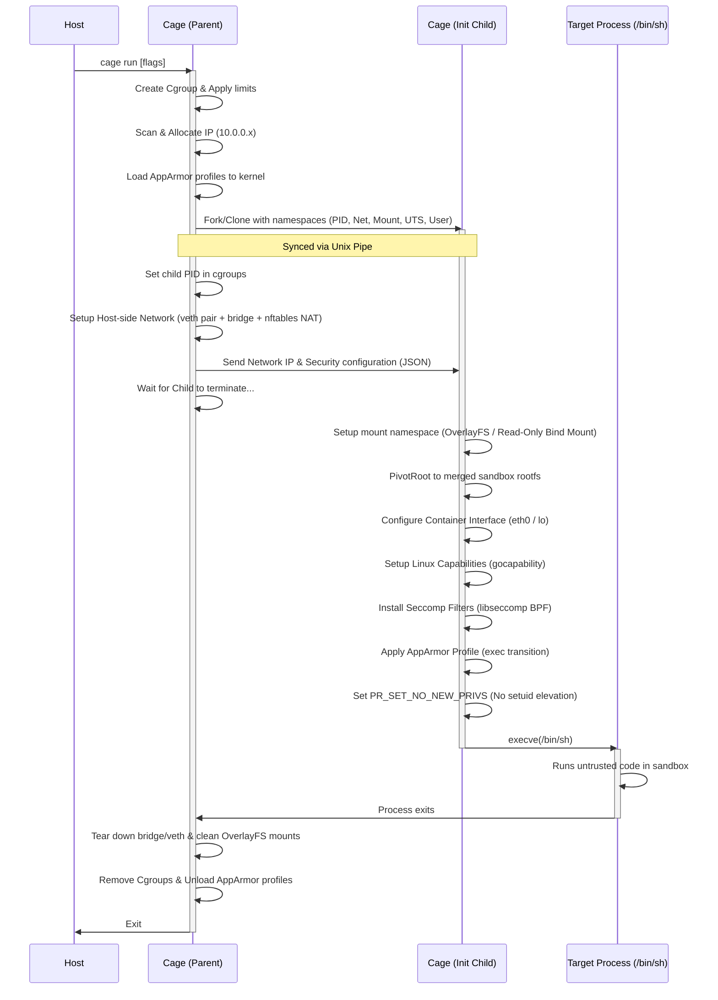

# Cage: A Secure Sandboxed Container Runtime

[](https://golang.org)
[](https://github.com/jsndz/cage)
[](https://opensource.org/licenses/MIT)

**Cage** is a lightweight, zero-trust container runtime written in Go. It is designed to execute untrusted or hostile workloads (such as AI-generated code, user-submitted scripts, or browser automation pipelines) under strict sandboxing guarantees. 

Unlike general-purpose runtimes (like Docker or runc) which prioritize developer convenience and application packaging, Cage focuses on **attack surface reduction**, **system call filtering**, **mandatory access control**, and **ephemeral isolation**.

---

## 🏗️ Architectural Overview

Cage uses a two-stage process execution model (Parent and Child) to safely configure isolation boundaries before executing target workloads.



---

## 🔒 Security Hardening Features

Cage combines several Linux kernel primitives and security modules to deliver defense-in-depth isolation:

*   **Namespace Isolation**: Spawns workloads in isolated Mount (`CLONE_NEWNS`), Process (`CLONE_NEWPID`), Network (`CLONE_NEWNET`), Hostname (`CLONE_NEWUTS`), and User (`CLONE_NEWUSER` for rootless) namespaces.
*   **System Call Filtering (Seccomp-BPF)**: Prevents processes from interacting with dangerous kernel APIs. Offers three profiles:
    *   `privileged`: No filtering.
    *   `default`: Blocks 40+ risky syscalls (e.g., `reboot`, `bpf`, `sysfs`, `keyctl`, namespace modification) returning `EPERM`.
    *   `sandbox`: A strict whitelist allowing only file/network I/O, process, and memory management essential for standard environments.
*   **Mandatory Access Control (AppArmor)**: Dynamically generates, loads, and applies security profiles:
    *   `default`: Restricts writes to sensitive `/proc` and `/sys` interfaces, denies mount/pivot operations, and disables `ptrace` of other processes.
    *   `sandbox`: A highly-restricted policy that enforces a read-only rootfs (blocking all writes except to `/tmp`, `/var/tmp`, `/dev/null`, and `/dev/zero`), denies all networking, and blocks ptrace/mount operations.
*   **Linux Capabilities dropping**: Uses `syndtr/gocapability` to clear the process capability bounding set. Retains only the minimum set needed (or none in `sandbox` mode) and allows precise control via `--cap-add` and `--cap-drop`.
*   **No New Privileges (`no-new-privs`)**: Enables the kernel's `PR_SET_NO_NEW_PRIVS` flag, preventing processes from gaining additional privileges through `setuid`/`setgid` binaries.
*   **cgroups v2 Resource Constraints**: Prevents DoS (Denial of Service) attacks by limiting CPU quota, memory maximum bytes, and PID limits.
*   **Rootless Execution**: Allows unprivileged users to execute sandboxes using user namespaces, `fuse-overlayfs` for layered filesystems, and `slirp4netns` for network isolation.

---

## 🎛️ CLI Options Reference

Cage is configured via command-line flags. Below is the flag specification:

| Flag | Type | Default | Description |
| :--- | :--- | :--- | :--- |
| `--cpu` | `int` | `4` | Maximum CPU cores available to the container. |
| `--mem` | `int64` | `536870912` | Memory limit in bytes (Default: 512MB). |
| `--pids` | `int` | `100` | Maximum number of processes/threads in the sandbox. |
| `-p` | `string` | `""` | Port forwarding mapping (e.g., `8080:80`). |
| `--profile` | `string` | `""` | Security profile configuration: `default`, `sandbox`, `privileged`. |
| `--cap-add` | `string` | `""` | Add specific capabilities (comma-separated, e.g., `CAP_SYS_ADMIN,CAP_NET_ADMIN`). |
| `--cap-drop` | `string` | `""` | Drop specific capabilities (comma-separated, e.g., `CAP_MKNOD`). |
| `--read-only` | `bool` | `false` | Bind-mount the rootfs as read-only (no writable upper layer). |
| `--rootless` | `bool` | `false` | Run container in rootless mode (no root permissions required). |

---

## 🚀 Getting Started

### Prerequisites

Ensure your host system meets the following requirements:
*   Linux Kernel (v5.8+ recommended for cgroups v2 and AppArmor features).
*   Go (v1.25+ recommended).
*   Installed utilities: `nftables`, `apparmor-utils` (`apparmor_parser`), `libseccomp` development headers.
*   For rootless execution: `fuse-overlayfs`, `slirp4netns`.

```bash
# Ubuntu/Debian dependency installation
sudo apt-get update
sudo apt-get install -y libseccomp-dev apparmor-utils nftables fuse-overlayfs slirp4netns
```

### 1. Build the Cage Runtime
Compile the runtime binary:
```bash
go build -o cage cmd/main.go
```

### 2. Prepare a Root Filesystem (rootfs)
Cage executes workloads within a root filesystem directory. You can extract one from an official Docker image (e.g., Alpine Linux):

```bash
# Create directory for the rootfs
mkdir -p /tmp/rootfs

# Export Alpine container filesystem and extract it
docker export $(docker create alpine:latest) | tar -C /tmp/rootfs -xf -
```

### 3. Run the Sandbox
Execute a command inside the isolated sandbox:

```bash
# Run a secure shell with default capabilities and 256MB memory limit
sudo ./cage --mem 268435456 --profile default

# Run in strict sandbox mode (highly restricted read-only filesystem, blocked syscalls, no network)
sudo ./cage --profile sandbox --read-only
```

---

## 🛤️ Project Roadmap

The development of Cage is planned in stages, tracing from raw Linux namespaces to a production-grade compute platform:

*   [x] **Stage 1**: Minimal Container Runtime (Namespace isolation).
*   [x] **Stage 2**: Root Filesystem Isolation (OverlayFS & PivotRoot).
*   [x] **Stage 3**: Resource Isolation (cgroups v2).
*   [x] **Stage 4**: Container Networking (veth, bridges, nftables NAT/port mapping).
*   [x] **Stage 7**: Security Hardening (Seccomp, Capabilities, AppArmor, `no-new-privs`).
*   [ ] **Stage 5**: Image System (OCI registry integration, image pulling, layered cache).
*   [ ] **Stage 6**: Daemon + Runtime Architecture (gRPC Daemon, CLI-to-Daemon separation).
*   [ ] **Stage 8**: Policy Engine (YAML-based configuration profiles).
*   [ ] **Stage 9**: Strong Isolation Backends (gVisor runsc / Firecracker microVM integrations).
*   [ ] **Stage 10**: Ephemeral Execution API (pooled sandboxes, fast cold-starts).
*   [ ] **Stage 11/12**: Multi-Tenant Serverless compute infrastructure & Web Dashboard.

---

## 📄 License

Cage is open-source software licensed under the [MIT License](LICENSE).